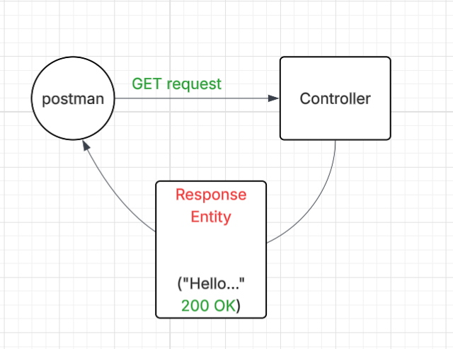

# L01-P01 — Hello API

## What I built
A Spring Boot REST endpoint that listens on GET /hello
and returns plain text "Hello, World!"

## diagram

## Key concepts learned
- @RestController combines @Controller + @ResponseBody
- @GetMapping("/hello/api") maps HTTP GET requests to a method
- Returning a ResponseEntity sends text/plain with HTTP 200 manually
- Spring Boot auto-configures an embedded Tomcat server

## How to run
./mvnw spring-boot:run
Then open: http://localhost:8080/hello

## Expected output
Hello, World!

## Annotations used
| Annotation | Purpose |
|---|---|
| @RestController | Marks class as REST controller |
| @GetMapping | Maps GET /hello/api to this method |