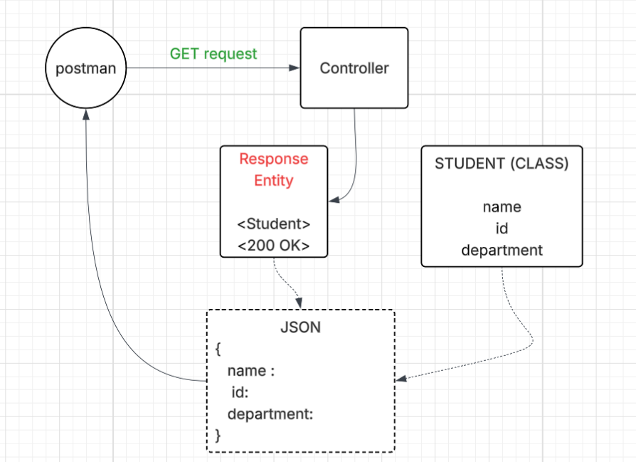

# L01-P02 — Student GET API

## What I built
A Spring Boot REST endpoint that listens on student/get
and returns java object pf type class Student converted into JSON "

## diagram

## Key concepts learned
- @RestController combines @Controller + @ResponseBody
- @GetMapping("/hello/api") maps HTTP GET requests to a method
- Returning a ResponseEntity sends text/plain with HTTP 200 manually
- Spring Boot auto-configures an embedded Tomcat server
- Client can be any thing , react/python and cannot understood the java object (What we define) hence a universal object JSON , is returned , Jackson converts the java object  into JSON 
-Lombok dependency  is used for Getter Setter , and Autowired to direct injecting the object from 

## How to run
./mvnw spring-boot:run
Then open: http://localhost:8080/student/get

## Expected output
{
    
    "name": "John",
    "id": "0901CSE26",
    "department": "Computer Sciecne"
}

## Annotations used
| Annotation | Purpose |
|---|---|
| @RestController | Marks class as REST controller |
| @GetMapping | Maps GET /hello/api to this method |