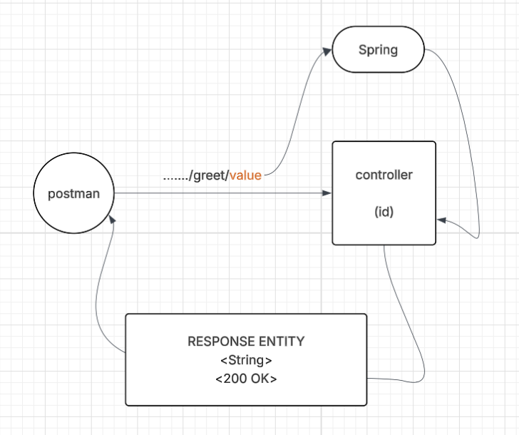

# L01-P03 — Greeting API

## What I built
A Spring Boot REST endpoint that listens on /greet/{value}
and returns String 

## diagram

## Key concepts learned
- @PathVariable , to fetch the information from url  
 

## How to run
./mvnw spring-boot:run
Then open: http://localhost:8080/greet/{value}

## Expected output
Hi "value"

## Annotations used
| Annotation | Purpose |
|---|---|
| @RestController | Marks class as REST controller |
| @GetMapping | Maps GET /hello/api to this method |