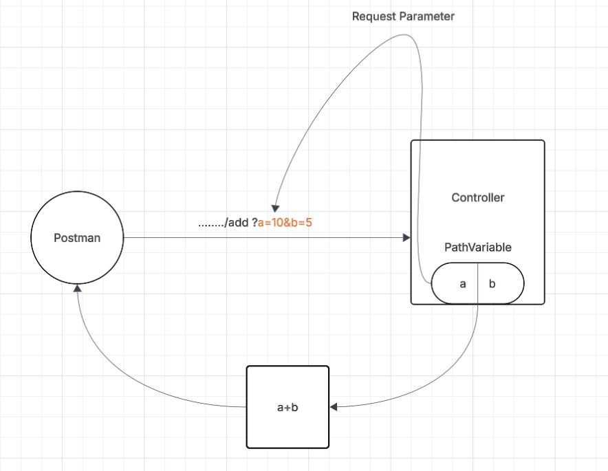

# L01-P04 — Add API

## What I built
A Spring Boot REST endpoint that listens on /add/?x=1&y=2
and returns the sum of x and y

## diagram

## Key concepts learned
- @RequestParamter , to fetch the information from url , present after query parameter , used while filtering or searching 
eg :  product based on {brand,price}  
eg : coding problems based on {difficulty,topic}
 

## How to run
./mvnw spring-boot:run
Then open: http://localhost:8080//add/?x=1&y=2

## Expected output
3

## Annotations used
| Annotation | Purpose |
|---|---|
| @RestController | Marks class as REST controller |
| @GetMapping | Maps GET /hello/api to this method |
| @RequestParameter| Maps GET /hello/api to this method |