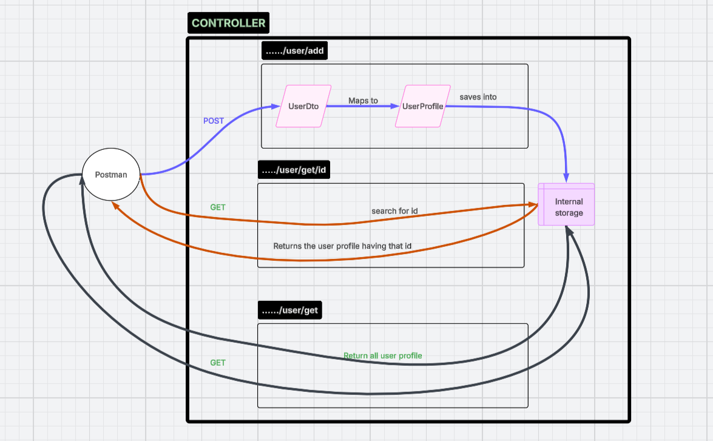

# L01-P05 — UserProfile

## What I built
A Spring Boot REST endpoint that listens on /user/add  to save user.
A Spring Boot REST endpoint that listens on /user/get/id  to fetch the user with usrid = id.
A Spring Boot REST endpoint that listens on /user/get  to fetch all the  user.

## diagram

## Key concepts learned
- The Controller class is by default a singleton bean (the spring will keep one object of that class and share among all , no multiple objects are created)
  that is why our in-memory hashmap persist the data , even after new calls.
 

## How to run
./mvnw spring-boot:run
Then open: http://localhost:8080/user/add  
Then open: http://localhost:8080/user/get/id
Then open: http://localhost:8080/user/get

## Expected output
(based on input.)

## Annotations used
| Annotation | Purpose |
|---|---|
| @RestController | Marks class as REST controller |
| @GetMapping | Maps GET /hello/api to this method |
| @PathVariable| to get value directly from url    |
| @RequestBody| to convert json into java and vice |
